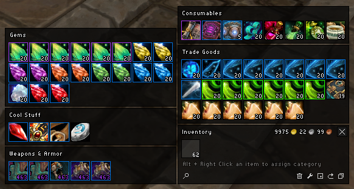

# cargBags_Nivaya-wotlk
cargBags_Nivaya backported to wotlk 3.3.5a

## What is it

This is an inventory addon featuring item filters, new items, support for item sets, empty bagspace compression and alot more. 
I am not the original author of this addon, I have only backported it to be compatible with the 3.3.5a client.

Original page can be found here: https://www.curseforge.com/wow/addons/cargbags-nivaya-mop-update

## New in v1.3

Restacking and sorting is back! The addon MrPlow now comes bundled and will be utilized to sort and restack your bags. Find the restack button in your inventory on the bottom right section. Note, to hide the MrPlow minimap button type: `/mrplow minimap` in game.

## How to install

Go to Releases in https://github.com/nullfoxh/cargBags_Nivaya-wotlk/releases and download cargBags_Nivaya.zip. Extract it to your World of Warcraft/Interface/AddOns folder and you're done! Once you're done the path should look like World of Warcraft/Interface/AddOns/cargBags_Nivaya/cargBags_Nivaya.toc.

